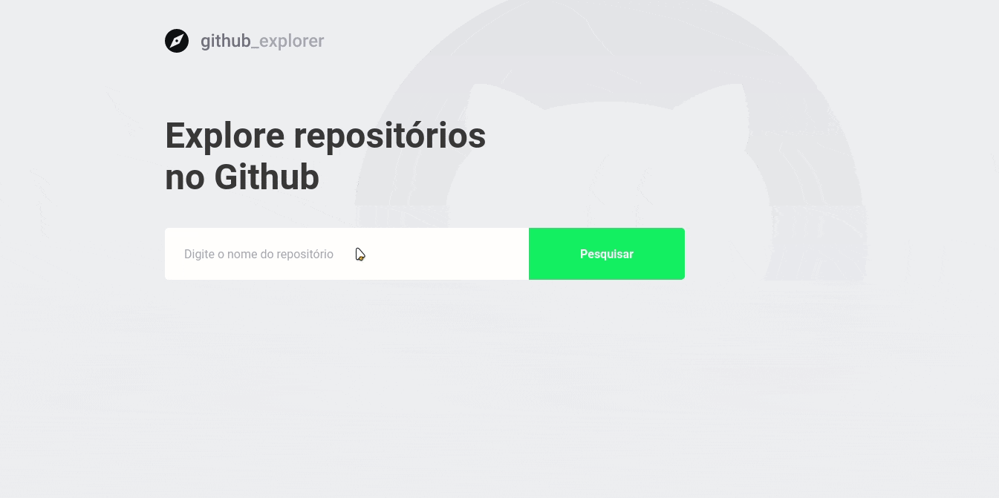

<div align="center" >
  
</div>
<br>

## 💻 Demo
<div align="center" >
  
</div>

## 🛠 Tecnologias

Esse projeto foi desenvolvido com as seguintes tecnologias:

- React
- Typescript
- LocalStorage
- Styled-components
- React-hooks
- Axios
- Eslint
- Prettier

## 📜 Projeto
Esse projeto permite que o usuário busque repositórios do github e informe alguns dados como stars, forks e issues.

### ⚙️ Rodando o Web

```bash
# Clone este repositório
$ git clone https://github.com/Brenerr/Github-Explorer

# Acesse a pasta do projeto no terminal/cmd
$ cd Github-Explorer

# Instale as dependências
$ yarn

# Execute a aplicação
$ yarn start
